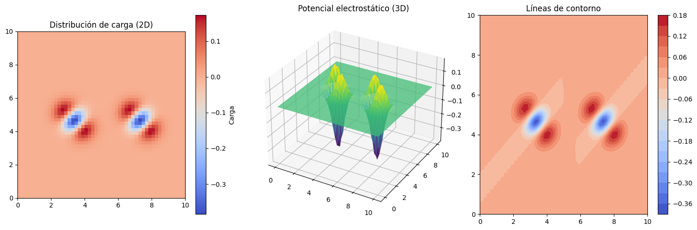
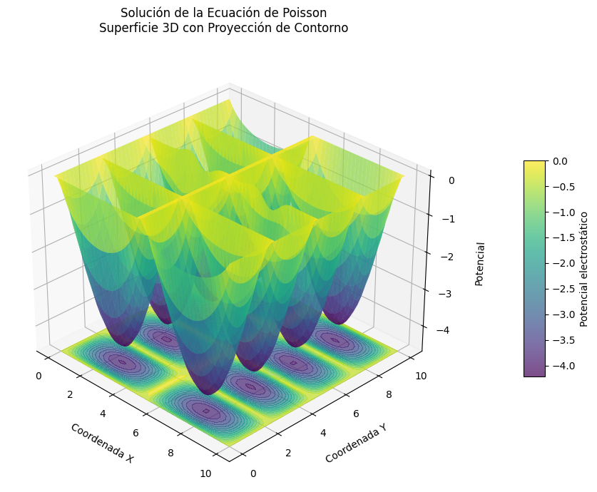

# Preguntas: 

### 7. 
Let $ \Delta \phi(p) = f(p) $ be the Poisson equation with non-vanishing heterogeneous term $f(p) \ne 0 $ analogous to the section about Jacobi iteration).

# (a)
Derive the corresponding update rule for the image matrix `data`:

$$
\text{data}[i,j] \leftarrow \frac{\text{data}[i+1,j] + \text{data}[i-1,j]}{4} + \frac{\text{data}[i,j+1] + \text{data}[i,j-1] - \text{rho}[i,j]}{4}
$$

where `rho` is the discretized version of $ f $ with the same shape as `data`.

# (b)
Design an MPI algorithm that distributes the matrix `data` on a two-dimensional grid of tiles.  
Make use of derived datatypes in order to efficiently communicate columns between neighboring blocks.

# (c)
Compare the runtime of the algorithm that employs a one-dimensional distribution of tiles and your novel two-dimensional partition for a reasonable number of processes.  
Can you back up your experimental measurements with theoretical ideas?


### Respuestas:

## (a)

Primero consideramos usar el Método de Diferencias Finitas, una malla de puntos espaciales donde la función del voltaje estará discretizada. 

Sea $h$ la distancia entre estos puntos espaciales. 

$$x_i = ih, \ \ \ y_j = jh, \ \ \ \phi(i,j)=\phi(x_i,y_j)$$

$$\Delta = \sum^{d-1}_{k=0} \partial ^2 _{x^{2}_{k}} = \partial ^{2}_{x^{2}_{0}} + ... + \partial ^{2} _{x^{2}_{d-1}}$$

El último correspondiendo al operador Laplaciano. Entonces, escribiendo la ecuación de Poisson:

$$\partial ^2 _{x^{2}} \phi (i,j) + \partial ^2_{y^{2}} \phi(i,j) = -\frac{ \rho(i,j)}{\epsilon _0}$$

Aproximando la segunda derivada respecto a $x$ e $y$, obtenemos:

$$\partial^2_{x^2} \phi(i,j) = \frac{\phi(i+1,j) - 2\phi(i,j) + \phi(i-1,j)}{h^2}$$

$$\partial^2_{y^2} \phi(i,j) = \frac{\phi(i,j+1) - 2\phi(i,j) + \phi(i,j-1)}{h^2}$$

Reemplazando:

$$\frac{\phi(i+1,j) - 2\phi(i,j) + \phi(i-1,j + \phi(i,j+1) - 2\phi(i,j) + \phi(i,j-1))}{h^2} = - \frac{\rho (i,j)}{\epsilon _0}$$

Factorizando y despejando para $\phi(i,j)$:

$$\phi(i,j) = \frac{1}{4} \left( \phi(i+1,j) + \phi(i-1,j) + \phi(i,j+1) + \phi(i,j-1) + \frac{h^2 \rho(i,j)}{\epsilon_0} \right)$$

Lo cual es equivalente a la ecuación dada en pregunta (a).

## (b)

### Generación de malla cargada.

En el archivo gen_vis_data.ipynb, se generó una malla cargada de 50x50 considerando a los 6 átomos que componen las 2 moléculas de agua. Se definió la carga_gaussiana para designar la distribución espacial de las cargas en la malla.


```python
def carga_gaussiana(x, y, x0, y0, sigma, charge):
   
    return charge * np.exp(-((x - x0)**2 + (y - y0)**2) / (2 * sigma**2))

```

Luego, se visualizó la data en 3 gráficos. El primero para observar la data generada del formato csv. El segundo es el potencial en 3D que corresponde a como debería observarse en el código que se generará utilizando MPI y la iteración de Jacobi para la ecuación de Poisson. El último corresponde a las líneas de contorno de este potencial.



Ahora pasaremos al codigo poisson.c para generar las soluciones de la ecuación de Poisson utilizando la iteración de Jacobi y MPI.

### lectura archivo csv

Para leer el archivo csv de la malla cargada de 50x50

``` c
void read_csv(double grid[N][N], const char *filename) {
    FILE *file = fopen(filename, "r");
    if (!file) {
        perror("Error opening file");
        MPI_Abort(MPI_COMM_WORLD, 1);
    }
```

### Inicialización de MPI

- MPI_init: inicializa el entorno MPI.

- MPI_Comm_rank/size: Obtiene el identificador del proceso y el número total de procesos

- Topología cartesiana: Crea una malla 2D de procesos para organizar la comunicación.

``` c
int main(int argc, char **argv) {
    MPI_Init(&argc, &argv);

    int rank, size;
    MPI_Comm_rank(MPI_COMM_WORLD, &rank);
    MPI_Comm_size(MPI_COMM_WORLD, &size);

    // Crear una topología cartesiana 2D
    int dims[2] = {0, 0};
    MPI_Dims_create(size, 2, dims);
    int periods[2] = {0, 0}; // No periódico
    MPI_Comm cart_comm;
    MPI_Cart_create(MPI_COMM_WORLD, 2, dims, periods, 0, &cart_comm);
``` 

### Distribución de datos

- División de dominio: Divide la malla NxN en bloques más pequeños para cada proceso

- Distribución: MPI_Scatter para repartir los datos a todos los procesos.

``` c
int local_rows = N / dims[0];
int local_cols = N / dims[1];

// Distribuir datos a todos los procesos
        int counts[size], displs[size];
        for (int proc = 0; proc < size; proc++) {
            int proc_coords[2];
            MPI_Cart_coords(cart_comm, proc, 2, proc_coords);

            int proc_rows = N / dims[0];
            int proc_cols = N / dims[1];
            if (proc_coords[0] < remainder_rows) proc_rows++;
            if (proc_coords[1] < remainder_cols) proc_cols++;

            counts[proc] = proc_rows * proc_cols;
            displs[proc] = 0; // 
        }

        MPI_Scatter(global_data, local_rows*local_cols, MPI_DOUBLE,
                   local_data, local_rows*local_cols, MPI_DOUBLE, 0, cart_comm);

``` 

### Comunicación de Bordes 

Para calcular correctamente los valores en los bordes de cada subdominio, los procesos necesitan intercambiar información con sus vecinos

- MPI_Cart_shift:  Identifica vecinos izquierda, derecha, arriba y abajo.

-Tipos derivados: Crea tipos de datos para comunicar columnas completas

``` c
 // tipos derivados para comunicación de bordes
    MPI_Datatype column_type;
    MPI_Type_vector(local_rows, 1, local_cols, MPI_DOUBLE, &column_type);
    MPI_Type_commit(&column_type);

``` 

### Iteración de Jacobi

Utilizando la ecuación de poisson de diferencias finitas encontrada en parte (a)

``` c
for (int i = 1; i < local_rows-1; i++) {
            for (int j = 1; j < local_cols-1; j++) {
                new_data[i][j] = (local_data[i+1][j] + local_data[i-1][j]) / 4.0 +
                                (local_data[i][j+1] + local_data[i][j-1]) / 4.0 -
                                rho[i][j] / 4.0;
                
                local_diff += fabs(new_data[i][j] - local_data[i][j]);
            }
        }
``` 
### Finalización

- Recolección de resultados: MPI_Gather reúne todos los datos en el proceso 0.

- Escritura del resultado: El proceso 0 guarda la solución final en un archivo poisson_solution.csv.

``` c
if (rank == 0) {
        double result[N][N];
        MPI_Gather(local_data, local_rows*local_cols, MPI_DOUBLE,
                  result, local_rows*local_cols, MPI_DOUBLE, 0, cart_comm);

        // Guardar resultado (simplificado)
        FILE *out = fopen("poisson_solution.csv", "w");
        for (int i = 0; i < N; i++) {
            for (int j = 0; j < N; j++) {
                fprintf(out, "%.6f%s", result[i][j], (j == N-1) ? "\n" : ",");
            }
        }
        fclose(out);
```

Sin embargo, el código posee un errores. Debido a que el plot del archivo resultante de este código da lo siguiente:



Por lo que podemos observar, es posible que hayan errores en:

- Condiciones iniciales y condiciones de borde: Ya que esta imagen muestra valores de potencial más grandes (-4, 0)[V] comparado con el que se muestra en el segundo gráfico inicial (-1.0, 0.5)[V]

- Inicialización de rho: tengo un error en la implementación de rho que no puedo identificar. Quizás no debería inicializarlo, debido a que los datos de las cargas vienen con la malla cargada. 

Cabe recalcar que el codigo fue ejecutado en un computador Macbook M2.

